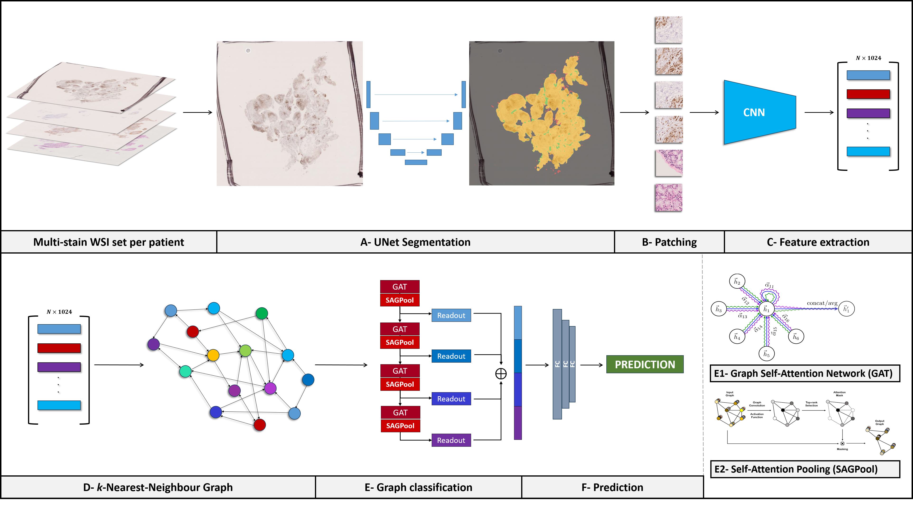

# Multi Stain Graph Attention Multiple Instance Learning - MUSTANG

--------------

Amaya Gallagher-Syed, Luca Rossi, Felice Rivellese, Costantino Pitzalis, Myles Lewis, Michael Barnes, Gregory Slabaugh "Multi-Stain Self-Attention Graph Multiple Instance Learning Pipeline for Histopathology Whole Slide Images", _British Machine Vision Conference_, Aberdeen. 2023. https://doi.org/10.48550/arXiv.2309.10650.

--------------

This code implements a graph neural network pipeline for whole slide image (WSI) classification using multi-stain embeddings and self-attention graph pooling.

## Usage

The main entry point is `main.py`. This handles loading the dataset, creating graphs, training and evaluation. 

These are the main command-line arguments:

```
--dataset_name: Name of the dataset.
--PATH_patches: Path to the CSV file with patch file locations.
--embedding_vector_size: Size of the embedding vector.
--learning_rate: Learning rate for training.
--pooling_ratio: Pooling ratio used in the model.
--heads: Number of GAT (Graph Attention Network) heads.
--K: Number of nearest neighbors in the k-Nearest Neighbor Graph (k-NNG) created from WSI embeddings.
--train_fraction: Fraction of data used for training.
--num_epochs: Number of training epochs.
--n_classes: Number of classes for classification.
```
Here's an example of how to use the code:

```bash
python main.py --dataset_name RA --PATH_patches df_labels.csv --embedding_vector_size 1024 --learning_rate 0.0001 --pooling_ratio 0.7 --heads 2 --K 5 --train_fraction 0.7 --num_epochs 30 --n_classes 2
```

### I am currently updating the code and will provide a step by step explanation on how to run it. 




The MUSTANG pipeline is composed of:

• <b>A - Segmentation</b>: A automated segmentation step, where UNet is used to segment tissue areas on the WSIs. The user can use the trained weights provided on our GitHub repository or use their own.

• <b>B - Patching</b>: After segmentation, the tissue area is divided into patches at a size chosen by the user, which can be overlapping or non-overlapping.

• <b>C - Feature extraction</b>: Each image patch is passed through a VGG16 CNN feature extractor and embedded into a [1 × 1024] feature vector. All feature vectors from a given patient are aggregated into a matrix. The number of rows in the matrix will vary as each patient has a variable set of WSIs, each with their own dimensions.

• <b>D - k-Nearest-Neighbour Graph</b>: The matrix of feature vectors of each patient is used to create a sparse directed k-NNG using the Euclidean distance metric, with a default of k = 5. The attribute of each node corresponds to a [1 × 1024] feature vector. This graph is used as input to the GNN.

• <b>E - Graph classification</b>: The k-NNG is successively passed through four Graph Attention Network layers (GAT) [34] and SAGPooling layers [26]. The SAGPooling readouts from each layer are concatenated and passed through three MLP layers and finally classified.

• <b>F - Prediction</b>: A pathotype or diagnosis prediction is obtained at the patient-level.
